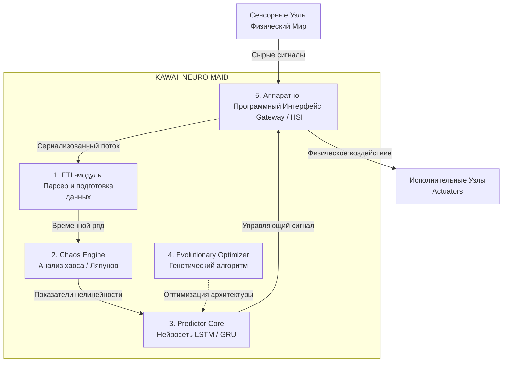

# Kawaii Neuro Maid (KNM) — Adaptive Smart Home Agent (★ω★)

> **Тема проекта:** Разработка адаптивного интеллектуального агента для персонализации сценариев умного дома на основе нейроэволюционных алгоритмов.

---

## 💡 О проекте (◕‿◕)

Человеческая жизнь в доме — это нелинейная динамическая система, а не жесткое расписание робота. Мы просыпаемся в разное время, меняем планы и устраиваем вечеринки. Стандартная автоматизация по таймерам в таких условиях работает плохо, приводя к ложным срабатываниям.

**Kawaii Neuro Maid (KNM)** — это интеллектуальный агент, который адаптирует сценарии умного дома под реальный контекст жизни пользователя. Система анализирует уровень "хаотичности" внешней среды и динамически изменяет чувствительность нейросетевого предиктора.

---

## 🏗️ Архитектура системы (｀^´)

> 📄 **[Подробная спецификация модулей и системных решений описана в docs/architecture.md](docs/architecture.md)**

Проект спроектирован по принципам чистой архитектуры (*Clean Architecture*) и состоит из 5 независимых слабосвязанных модулей:



---

## 🛠️ Технологический стек (☆_@)

*   **Core / ML:** 
*   **Math:** 
*   **Hardware / Embedded:** 
*   **DevOps / Docs:** Git, Markdown, Mermaid, Obsidian

---

## 🚀 Быстрый старт (￣▽￣)ノ

*Инструкция по развертыванию локальной среды:*

1. Склонируйте репозиторий:
```bash
git clone https://github.com/DakariLuin/kawaii-neuro-maid
cd kawaii-neuro-maid
```

2. Пока всё... 🦗

---

> *«Проект находится на стадии активного проектирования. Следите за обновлениями коммитов!»* (◕‿◕)