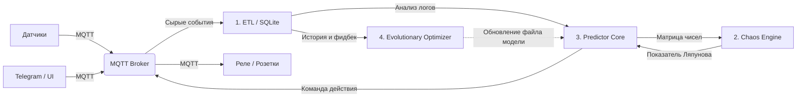

### Высокоуровневая архитектура KNM (Архитектурные блоки)

Наша система должна состоять из независимых модулей. Это позволит нам писать и тестировать их отдельно друг от друга.

---

## 📋 Детальное проектирование модулей (Принцип единственной ответственности)

### Блок 1: ETL-модуль (Extract, Transform, Load)
*   **Задача:** Сбор сырых событий от MQTT-брокера (активность датчиков и отзывы пользователя из Telegram) и запись их в соответствующие таблицы БД SQLite. Подготовка квантованных временных рядов по запросу.
*   **Вход:** MQTT-сообщения из топиков `home/sensors/+` и `home/ui/feedback`.
*   **Выход:** Запись транзакций в локальную БД SQLite. Предоставление числовых матриц для Блока 3 и Блока 4.

### Блок 2: Chaos Engine (Математический калькулятор)
*   **Задача:** Изолированный математический расчет показателя Ляпунова ($\lambda$) на скользящем окне данных. Не имеет внутреннего состояния и не привязан к логике умного дома.
*   **Вход:** Числовой массив временного ряда от Блока 3.
*   **Выход:** Число с плавающей точкой (величина показателя Ляпунова $\lambda$).

### Блок 3: Predictor Core (Приниматель решений)
*   **Задача:** Периодический опрос БД SQLite, расчет текущего хаоса через Блок 2, прогнозирование следующего действия нейросетью (LSTM) и публикация команд управления в MQTT при превышении динамического порога.
*   **Вход:** Срез свежих данных из SQLite (Блок 1) + Коэффициент хаоса $\lambda$ (Блок 2).
*   **Адаптивная логика:** Порог принятия решений меняется динамически: $Threshold = f(\lambda)$. При высоком хаосе чувствительность падает (блокировка ложных срабатываний), при низком — возрастает.
*   **Выход:** Публикация команд в MQTT-топики исполнителей (`home/actuators/+`) и уведомлений в топик интерфейса (`home/ui/notifications`).

### Блок 4: Evolutionary Optimizer (Фоновый тренер)
*   **Задача:** Офлайн-оптимизация структуры и весов нейросети методом генетического алгоритма. Запускается по расписанию в фоновом режиме на исторических данных, включая логи отказов пользователя.
*   **Вход:** Исторические таблицы активности и фидбека пользователя из БД SQLite (Блок 1).
*   **Выход:** Перезапись файла оптимизированной модели (`model_best.tflite`) на диске для Блока 3.

### Блок 5: Аппаратно-Программный Интерфейс (Железо и Шлюз)
*   **Задача:** Трансляция физических сигналов датчиков в MQTT-топики и выполнение MQTT-команд физическими актуаторами под управлением жестких аппаратных предохранителей (Guardrails).
*   **Ограничители безопасности (Guardrails):** Жесткие логические правила на стороне прошивки микроконтроллеров (например, отключение реле чайника при отсутствии тока нагрузки или по таймауту в 3 минуты).
*   **Вход:** Физические изменения среды / MQTT-команды из топиков управления.
*   **Выход:** MQTT-сообщения о статусе датчиков / Физическое переключение реле.

### Блок 6: Пользовательский Интерфейс (UI)
*   **Задача:** Автономное информирование пользователя через мессенджер и публикация его мгновенных команд или отчетов обратной связи в шину данных MQTT.
*   **Вход:** MQTT-сообщения из топика уведомлений `home/ui/notifications`.
*   **Выход:** Публикация команд вето или логов фидбека в топик `home/ui/feedback`.
