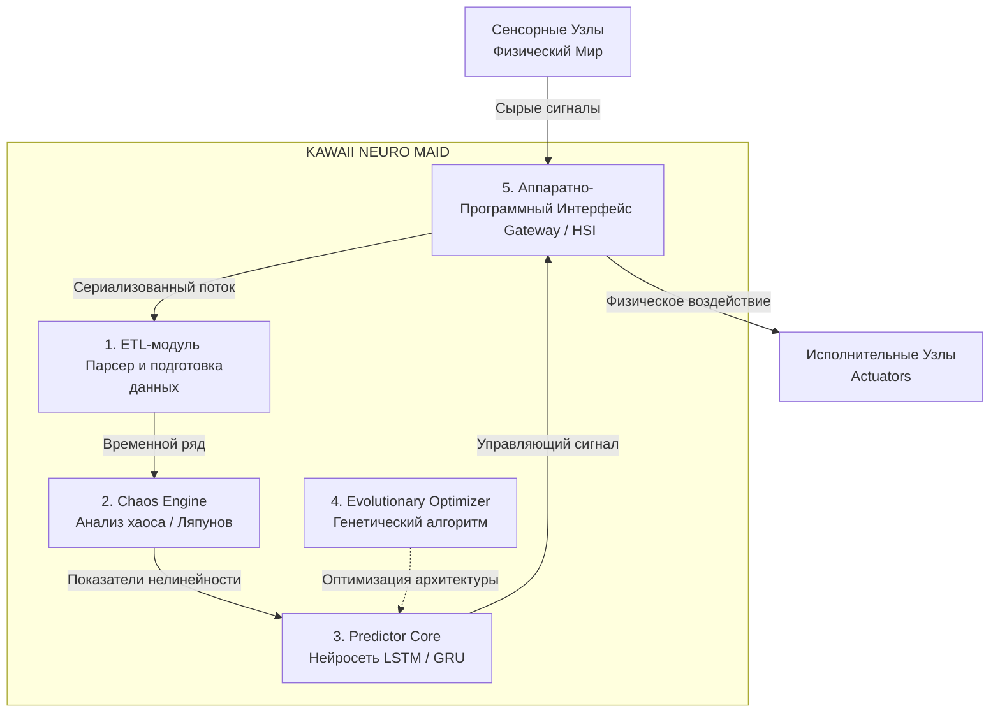

### Высокоуровневая архитектура KNM (Архитектурные блоки)

Наша система должна состоять из независимых модулей. Это позволит нам писать и тестировать их отдельно друг от друга.

Давай разобьем проект на **4 ключевых программных блока** и **1 аппаратный**:

---

### Детальное проектирование модулей

#### Блок 1: ETL-модуль (Extract, Transform, Load)
*   **Задача:** Собрать сырые логи умного дома (из файла или по сети) и превратить их в красивый непрерывный временной ряд.
*   **Вход:** Текстовые строки логов вида `[Время / Датчик / Статус]`.
*   **Выход:** Числовой массив плотности активности (например, сколько датчиков сработало за каждые 5 минут).

#### Блок 2: Chaos Engine (Математический анализатор)
*   **Задача:** Рассчитать степень «хаотичности» жизни пользователя прямо сейчас.
*   **Вход:** Временной ряд от Блока 1.
*   **Выход:** Спектр показателей Ляпунова или уровень энтропии. Если показатель высокий — пользователь ведет себя непредсказуемо (выходной, гости), нейросеть должна быть «осторожнее». Если показатель низкий — поведение циклическое (будний день), нейросеть может действовать увереннее.

#### Блок 3: Predictor Core (Нейросеть)
*   **Задача:** Предсказать следующее действие.
*   **Вход:** История событий за последние N часов.
*   **Выход:** Вероятность включения конкретного прибора (например, чайника) в ближайшие 15 минут.

#### Блок 4: Evolutionary Optimizer (Генетический алгоритм)
*   **Задача:** Вместо нас подобрать идеальный размер нейросети (сколько слоев, сколько нейронов), чтобы она была точной, но при этом маленькой (чтобы влезла на железо).
*   **Вход:** Набор случайных архитектур нейросетей.
*   **Выход:** Файл весов и структуры идеальной модели (`model.tflite`).

#### Блок 5: Аппаратно-Программный Интерфейс (Hardware-Software Interface / HSI)
*   **Задача:** Двунаправленная трансляция физических событий в программные структуры данных и обратно.
*   **Компоненты абстракции:**
    *   **Сенсорные узлы (Sensors):** Событийные источники данных, регистрирующие дискретные или непрерывные изменения состояния внешней среды (входные сигналы системы).
    *   **Исполнительные узлы (Actuators):** Приемники управляющих команд, изменяющие физическое состояние внешней среды (выходные сигналы системы).
    *   **Коммуникационный шлюз (Gateway):** Промежуточный слой, отвечающий за сериализацию сигналов от сенсоров в цифровой поток данных для **Блока 1 (ETL)** и десериализацию программных команд от **Блока 3 (Predictor)** в управляющие импульсы для исполнителей.

